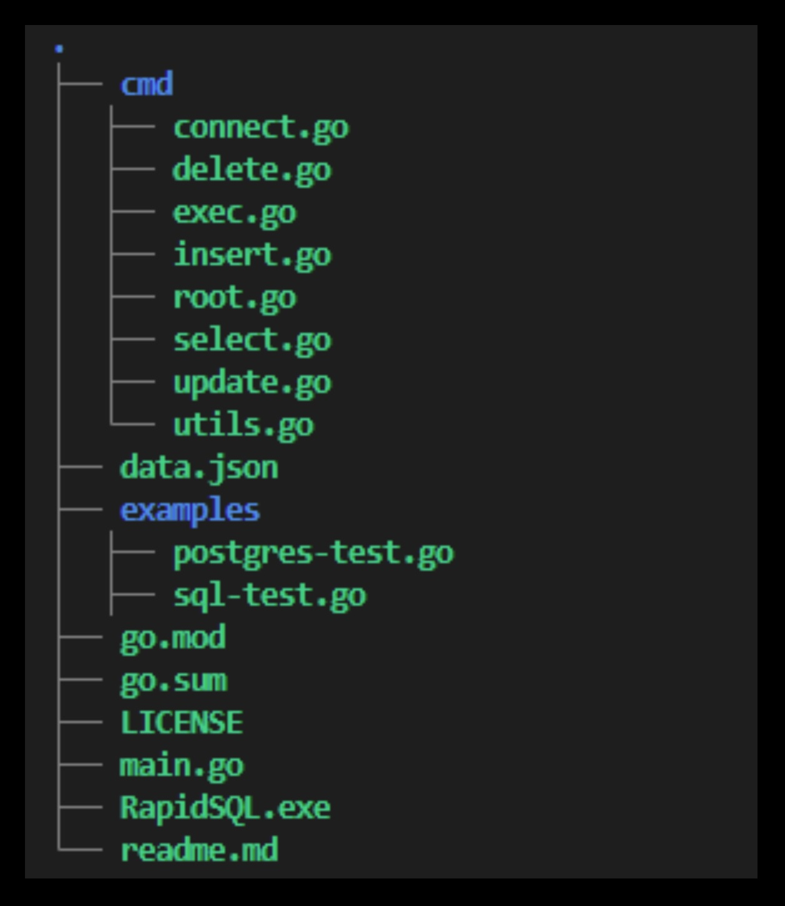
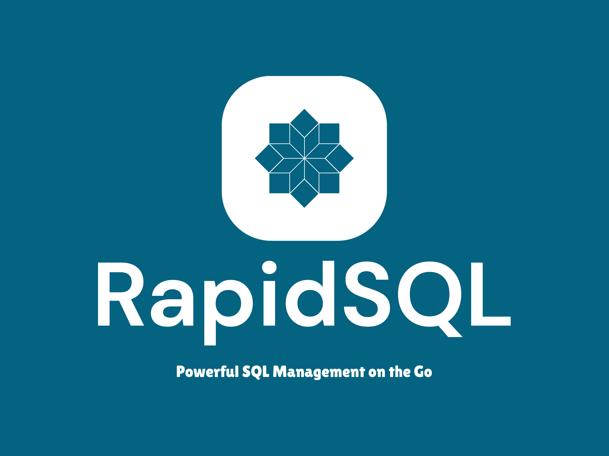

# RapidSQL

RapidSQL is a sophisticated command-line interface (CLI) tool designed with careful thought and precision, embodying high-level proficiency in the Go language, PostgreSQL database management, and CLI tool creation. This project stands as a testament to a deep-rooted understanding of these technologies and the ability to orchestrate them into a seamless, fully functional application.

## Integration of Key Technologies

RapidSQL incorporates a selection of powerful technologies, each chosen for their robustness and reliability:

1. **Go Language**: The Go language forms the backbone of RapidSQL, selected for its statically typed, compiled language features that ensure reliability and efficiency in software delivery.

2. **PostgreSQL**: RapidSQL interacts directly with PostgreSQL, an advanced open-source object-relational database system. This reinforces the ability to manage complex database structures and understand the nuances of database management systems.

3. **Cobra Library**: For the creation of its CLI, RapidSQL utilizes the Cobra library, renowned for its ability to develop modern, user-friendly command-line interfaces.


## Codebase Structure

The codebase of RapidSQL adheres to a highly structured, modular approach. Each operation, such as 'insert' or 'update', is encapsulated within its separate module, fostering an environment for easy maintainability and extensibility. This architecture greatly facilitates the process of debugging and improving individual components of the tool.



## Core Functionalities

RapidSQL, while being a demonstration of technical prowess, offers practical, functional value:

- **Database Connection**: Users can connect to a PostgreSQL database by providing necessary credentials, exemplifying seamless database connectivity.

- **CRUD Operations**: RapidSQL allows users to perform Create, Read, Update, and Delete operations on specific database tables, showing a comprehensive understanding of basic database operations.

- **Custom Query Functionality**: In addition to standard CRUD operations, RapidSQL enables users to execute custom SQL queries directly, indicating an ability to provide flexible, custom solutions to meet user requirements.

## Dependencies

RapidSQL efficiently manages its dependencies, as detailed in the `go.sum` file. These dependencies include packages for the Cobra CLI library, PostgreSQL interaction, and more, demonstrating the capability to effectively incorporate and manage external libraries and packages.

```go
module RapidSQL

go 1.20

require (
	github.com/inconshreveable/mousetrap v1.1.0 // indirect
	github.com/lib/pq v1.10.9 // indirect
	github.com/mattn/go-sqlite3 v1.14.17 // indirect
	github.com/spf13/cobra v1.7.0 // indirect
	github.com/spf13/pflag v1.0.5 // indirect
)
```

## Concluding Remarks

RapidSQL is more than a tool—it is a narrative of the developer's skills and potential. It speaks to a strong proficiency in a range of domains: Go programming, PostgreSQL databases, CLI tool creation, and more. The project serves as an invitation to potential employers to explore the developer's breadth of knowledge, attention to detail, and commitment to quality.


